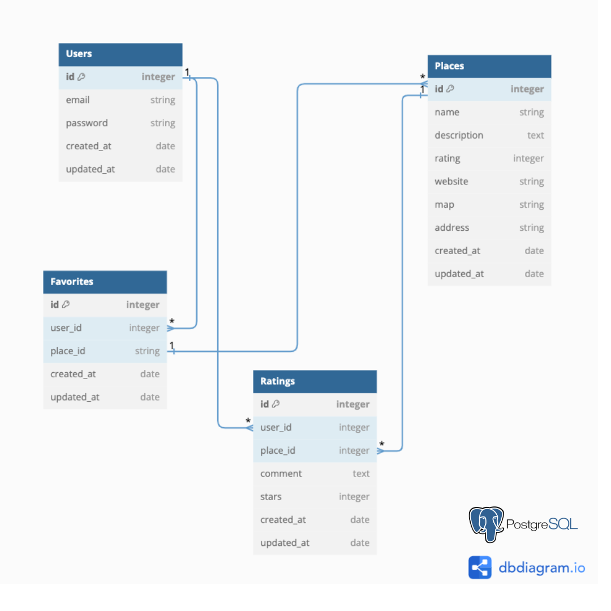

# Matcha Finder

Matcha Finder is a single-page web application where users can search for matcha by location, create a secure account, curate a personalized favorites list, where they can also review and rate results.

The app's interactivity is centered around the top navigation bar, featuring a search bar and various event-driven actions throughout the page. Users are greeted with the site's calming color palette of beige and green hues, complemented by picture cards showcasing matcha flavor pairings.

Users will feel that they're on a multi-page app as React's routing system changes the URL and re-renders components. Both React hooks, useState and useEffect are used for responsive navigation showing real-time updates during user interaction.

## Technologies

- Python
- PostgreSQL
- React
- Flask
- JavaScript
- Vite
- Bootstrap
- HTML
- CSS
- Google Places APIs:
  - https://developers.google.com/maps/documentation/places/web-service/text-search
  - https://developers.google.com/maps/documentation/places/web-service/details
- AWS

## Data Model

- Implemented a PostgreSQL database to manage data with one-to-many relationships between users and place results. This database schema also includes favorite places and place ratings.

<ul><a href=https://dbdiagram.io/d/matcha-finder-6671ee495a764b3c72d0f9b1>https://dbdiagram.io/d/matcha-finder-6671ee495a764b3c72d0f9b1</a></u>

  

## Key Features

### <ins> User Experience </ins>

- Users can query the Google Places API to dynamically retrieve a list of matcha places, including details such as the place name, address, and description.

### <ins> Registered User Experience </ins>

- Users can create an account. Once logged in, users can favorite and rate their place results.

## Future Development

- Logged in users can comment on/review places
- If the user visits a place more than once, average their ratings for that place
- Logged in users can set a date to visit and see last date visited
- Each place will display Google Map image

#

### Author

Jenny Fang is a fullstack software developer based in San Francisco. She enjoys preparing matcha lattes 🍵, finding the experience meditative and a great way to start the day. Jenny built this web app to make it easier for people to find and enjoy matcha.

🔗 Watch Matcha Finder demo below:
